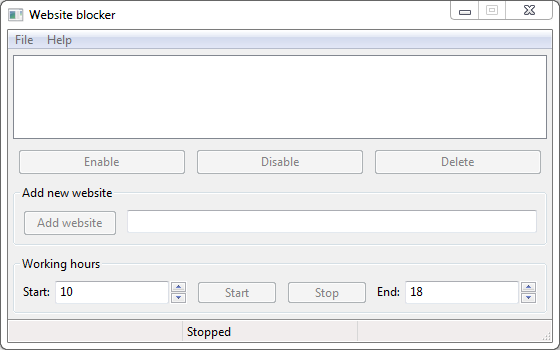

# website-blocker
[](https://travis-ci.org/alexcambose/website-blocker)

> Simple website blocker gui app built with Python and wxWidgets.

 

## Installation and usage

*Python **3.5+** required*
<details>
 <summary>Linux</summary>
  
```
pip3 install -r requirements.txt
```
For installing [wxPython](https://github.com/wxWidgets/Phoenix) there is **some additional setup needed**: [Official website](https://wxpython.org/pages/downloads/), Some other (better) [instructions](https://uwpce-pythoncert.github.io/Py300/notes/Installing_wxPython.html#linux)
### Running
You will need to run the script as *superuser* so that the script will be able to edit `/etc/hosts` file.
##### Method 1
```
cd website-blocker && ./run.sh
```
##### Method 2
```
cd website-bocker && sudo python3 index.py
```
</details>

<details>
  <summary>Windows</summary>

```
pip install -r requirements.txt
```
### Running
You will need to run the script as `administrator`.

Right click `website-blocker/winbuild/Website blocker.exe` and then select `run as administrator`.
</details>


**Only tested on Linux and Windows machines**
## About
Released under the [MIT](./LICENSE) License.
